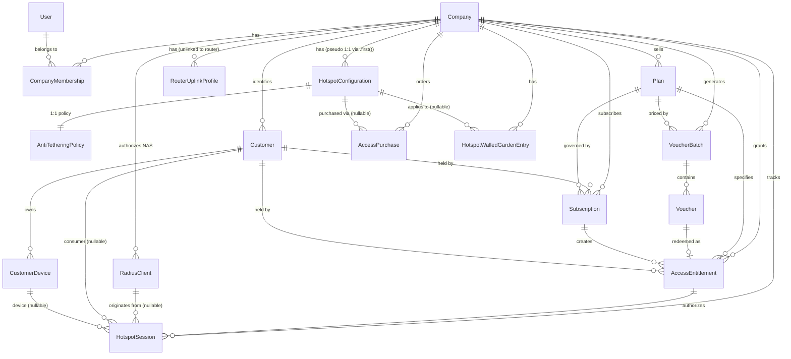
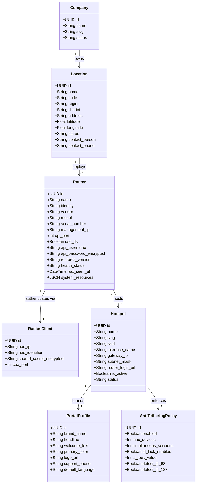

# Usimamizi Wi-Fi: Deep Architecture & UX Audit — Locations, Routers, and Hotspots

**Document Status:** Production Architectural Assessment & Audit  
**Date:** September 2026  
**Auditor:** Antigravity Agentic Systems Architecture  
**Target Scope:** `Locations`, `Routers`, `Hotspots`, FreeRADIUS NAS, MikroTik Management, and Multi-Tenant Topology  

---

## 1. Executive Summary

Usimamizi Wi-Fi has achieved production-grade capabilities in several critical functional domains: FreeRADIUS AAA with dynamic rate limiting and session timeouts, carrier-grade mobile payments (Snippe TZS), multi-provider SMS failover (RafikiSMS), voucher batch lifecycle management, RFC 3576 Packet of Disconnect (POD) enforcement, customer identity, and subscription renewals.

However, a forensic inspection of the operational infrastructure layer reveals a fundamental architectural disparity:

> **Core Verdict:** The platform does not currently implement a hierarchical infrastructure model. While the commercial and subscriber domains are multi-tenant and scalable, the physical and network infrastructure domain is currently structured as a **flat, pseudo-singleton lab architecture**.

### Status Matrix of Operational Infrastructure Entities

| Domain Concept | Database Model | Backend API | Frontend Experience | Evaluation |
| :--- | :--- | :--- | :--- | :--- |
| **Location** | **None** | **None** | `PlaceholderPage` ("Phase 3 Core") | **MISSING** |
| **Router** | **None** (Only `RadiusClient` exists for RADIUS AAA) | **None** (Uplink views hardcode single router) | `PlaceholderPage` ("Phase 3 & Phase 9") | **MISSING** |
| **Hotspot** | `HotspotConfiguration` (Conflates portal branding, SSID, handoff URL, and firewall policies) | Single default hotspot per company (`/api/v1/settings/hotspot/`) | Tab inside Settings / Redundant `/hotspots` route | **PARTIAL / RISK** |

### Key Risks Identified
1. **Singleton Assumptions:** Backend services (`uplink_services.py`, `anti_tethering_services.py`, `portal_services.py`) rely on `.first()` lookups, hardcoded loopback/LAN addresses (`10.5.50.1`, `10.5.50.254`), hardcoded interfaces (`wlan2`, `bridgeLocal`), and global environment variables (`MIKROTIK_HOST`, `MIKROTIK_PASSWORD`).
2. **Credential Vulnerabilities:** RouterOS management credentials fall back to insecure defaults (`admin:admin`) and cannot be configured per router or per company in the database. Wi-Fi uplink passwords are stored in plaintext in the database (`RouterUplinkProfile.password`).
3. **Missing Multi-Router / Multi-Hotspot Topology:** An operator cannot model multiple branches (Locations), assign multiple MikroTik routers to a branch, or run multiple SSIDs/HotSpots (e.g., Guest vs. Staff) on a single router.
4. **Disjointed Attribution:** `HotspotSession`, `AccessPurchase`, and `AccessEntitlement` lack persistent links to physical locations or specific hotspot interfaces, preventing branch-level revenue, traffic, and session reporting.

---

## 2. Current Architecture

### 2.1 Backend Domain Inspection

The backend codebase (`backend/apps/`) was thoroughly examined across all domain modules:

```text
backend/apps/
├── companies/
│   ├── models.py
│   │   ├── Company                 # Multi-tenant root entity
│   │   ├── CompanyMembership       # Tenant user association (No RBAC role field)
│   │   ├── HotspotConfiguration    # Single-tenant portal branding + SSID + handoff URL
│   │   ├── RouterUplinkProfile     # Uplink Wi-Fi profiles (Scoped to Company, not Router)
│   │   └── AntiTetheringPolicy     # 1:1 with HotspotConfiguration (TTL mangling)
│   ├── services/
│   │   ├── uplink_services.py      # Hardcoded 10.5.50.1, wlan2, port 8728, admin:admin
│   │   ├── anti_tethering_services.py # Hardcoded bridgeLocal, 10.5.50.254 exclude, global credentials
│   │   └── portal_services.py      # get_or_create_default_hotspot uses .first()
├── radius/
│   ├── models.py
│   │   ├── RadiusClient            # NAS entity (company, name, nas_ip, encrypted secret)
│   │   ├── EntitlementDevice       # MAC address whitelist for max_devices
│   │   └── RadiusAccountingLog     # Raw immutable packet stream
│   └── services/
│       └── radius_services.py      # resolve_nas uses nas_ip or falls back to .first()
├── hotspot_sessions/
│   ├── models.py
│   │   └── HotspotSession          # Links to Company, Entitlement, RadiusClient (No Location/Hotspot)
│   └── services/
│       └── session_control.py      # RFC 3576 POD resolves NAS from session.radius_client or .first()
├── plans/
│   └── models.py
│       └── Plan                    # Scoped to Company (No Location or Hotspot restriction)
├── vouchers/
│   └── models.py
│       ├── VoucherBatch            # Scoped to Company and Plan (No Location or Hotspot)
│       └── Voucher                 # Scoped to Company, Batch, and Plan
├── payments/
│   └── models.py
│       ├── AccessPurchase          # Scoped to Company, Plan, and nullable HotspotConfiguration
│       ├── PaymentTransaction      # Scoped to Company and Purchase
│       └── HotspotWalledGardenEntry # Scoped to Company and nullable HotspotConfiguration
└── customers/
    └── models.py
        ├── Customer                # Scoped to Company (E.164 phone unique per company)
        ├── CustomerDevice          # Scoped to Customer (MAC address, vendor)
        └── Subscription            # Scoped to Company, Customer, and Plan
```

### 2.2 Frontend Application Inspection

The frontend codebase (`frontend/src/`) was examined for navigation, views, and state management:

```text
frontend/src/
├── app/router.tsx
│   ├── /locations       ──► PlaceholderPage ("Locations Module — Phase 3 Core")
│   ├── /routers         ──► PlaceholderPage ("Routers Module — Phase 3 & Phase 9")
│   ├── /hotspots        ──► HotspotSettingsPage (Redirects to single default hotspot settings)
│   ├── /settings/hotspot──► HotspotSettingsPage (Branding + Anti-Tethering tabs)
│   └── /settings        ──► SettingsLayout (Tabs: General, Subscriptions, Payments, Uplink WAN, etc.)
├── components/layout/Sidebar.tsx
│   ├── "Locations"      ──► Badge "Phase 3", links to /locations
│   ├── "Routers"        ──► Badge "Phase 3", links to /routers
│   └── "Hotspots"       ──► Badge "Phase 3", links to /hotspots
└── features/
    ├── settings/
    │   ├── HotspotSettingsPage.tsx    # Single hotspot form (fetches /api/v1/settings/hotspot/)
    │   ├── AntiTetheringSettings.tsx  # Toggles TTL lock, TTL 63/127 drops
    │   └── UplinkNetworkSettings.tsx  # Scans wlan2, switches station profile on 10.5.50.1
    └── sessions/
        └── ActiveSessionsPage.tsx     # Displays sessions with NAS IP, but no Location/Hotspot
```

---

## 3. Current Model Relationship Diagram

This diagram reflects the **exact existing data model** in the codebase today:



### Critical Relationship Observations
1. **Location Entity is Absent:** No model represents a physical site or branch.
2. **Router Entity is Absent:** `RadiusClient` holds NAS IP and RADIUS secret, but does not represent a physical or logical router (no API credentials, hardware model, serial, RouterOS version, or management IP).
3. **HotspotConfiguration is Disconnected:** It has no link to a Router or a Location. It floats under `Company`.
4. **RouterUplinkProfile is Disconnected:** Uplink profiles (SSID/passphrase) belong to `Company`, completely detached from any router entity, interface, or location.

---

## 4. Locations Audit

### Current State
- **Database Model:** None (`MISSING`).
- **REST Endpoints:** None (`MISSING`).
- **Frontend View:** `/locations` points to `PlaceholderPage` with `EmptyState` component.

### Findings & Operational Analysis
- **Definition Failure:** In a multi-tenant Wi-Fi SaaS, a `Location` represents the physical deployment venue (e.g., "Kariakoo Flagship Branch", "Mbezi Beach Resort", "Arusha City Center Cafe"). It provides the geographic and operational context for hardware and revenue.
- **Missing Deployment Metadata:** There is currently no way to record physical addresses, regions (Dar es Salaam, Arusha, Mwanza), GPS coordinates (for map displays or geospatial compliance), site contact persons, or operational operating hours.
- **Reporting Blind Spot:** Because sessions, payments, and vouchers cannot link to a Location, tenant owners cannot answer basic commercial questions:
  - *Which branch generated the most revenue this week?*
  - *Which location has high network congestion or offline routers?*
  - *How many active customers are at Kariakoo right now?*

---

## 5. Routers Audit

### Current State
- **Database Model:** None (`MISSING`). Only `RadiusClient` exists in `apps/radius/models.py`.
- **RouterOS API Integration:** Synchronous raw socket communication via `RouterOSAPIClient` in `uplink_services.py`.
- **Frontend View:** `/routers` points to `PlaceholderPage` with `EmptyState` component.

### Findings & Operational Analysis
1. **NAS vs. Router Conflation:** `RadiusClient` is currently being misused as both the RADIUS AAA client record and the proxy for a physical router. However, `RadiusClient` lacks:
   - Management IP (which is often distinct from the NAS-IP, e.g., VPN tunnel IP vs. Hotspot bridge IP).
   - RouterOS API port (defaults to 8728).
   - API credentials (username/password).
   - Hardware details (Model, Serial Number, RouterOS architecture, Firmware version).
   - System telemetry (CPU utilization, RAM free, Disk free, Uptime, Temperature).
   - Health status (`ONLINE`, `OFFLINE`, `DEGRADED`, `UNREACHABLE`).
2. **Synchronous Socket Blocks:** In `uplink_services.py`, endpoints like `RouterUplinkStatusView` open a synchronous TCP socket to `10.5.50.1:8728` directly in the HTTP request thread. If the router is unreachable or slow, the Django worker thread blocks for up to 4.0 seconds per request, presenting a severe Denial of Service (DoS) vulnerability under load.
3. **Missing Hardware Inventory:** Operators cannot view a list of their MikroTik fleet, see firmware versions needing security patches (RouterOS CVEs), or track serial numbers for asset management.

---

## 6. Hotspots Audit

### Current State
- **Database Model:** `HotspotConfiguration` in `apps/companies/models.py`.
- **Relationship:** Scoped directly to `Company`.
- **Frontend View:** `/hotspots` renders `HotspotSettingsPage`, which is identical to the tab at `/settings/hotspot`.

### Findings & Operational Analysis
1. **Conflated Scope:** `HotspotConfiguration` currently bundles:
   - Captive portal customer branding (`brand_name`, `headline`, `welcome_text`, `primary_color`, `logo_url`).
   - Customer authentication handoff URL (`router_login_url = 'http://10.5.50.1/login'`).
   - Wireless SSID string (`ssid = 'Usimamizi-WiFi-Lab'`).
   - Anti-tethering security policy (1:1 `AntiTetheringPolicy`).
   - Walled garden pre-auth rules (`HotspotWalledGardenEntry`).
2. **The "Single Hotspot per Company" Trap:**
   - In `apps/companies/services/portal_services.py:65`:
     ```python
     def get_or_create_default_hotspot(company: Company) -> HotspotConfiguration:
         hotspot = HotspotConfiguration.objects.filter(company=company).first()
         ...
     ```
   - In `apps/companies/api/public_views.py:171` (`HotspotSettingsAdminView`):
     ```python
     hotspot = get_or_create_default_hotspot(company)
     return Response(AdminHotspotSettingsSerializer(hotspot).data)
     ```
   - **Consequence:** Even though the database schema technically permits multiple `HotspotConfiguration` rows per company, the entire management API and service layer hardcodes a `.first()` singleton. An operator cannot create a second hotspot (e.g., "Staff Wi-Fi" vs. "Guest Wi-Fi", or "Conference Hall" vs. "Lobby").
3. **Missing Router/Interface Binding:** A hotspot in MikroTik is an `/ip hotspot` server instance bound to a specific interface or VLAN (e.g., `bridgeLocal`, `vlan10-guest`, `vlan20-vip`). `HotspotConfiguration` has no knowledge of router interfaces, IP pools, or subnets.

---

## 7. Settings Ownership Matrix

Currently, configuration settings are scattered across the top-level `/settings` page without regard for logical operational ownership.

| Setting / Feature | Current Code Location | Current Scope in Code | Correct Architectural Scope | Recommended Remediation |
| :--- | :--- | :--- | :--- | :--- |
| **Uplink Wi-Fi / WAN Profiles** | `RouterUplinkProfile` | `Company` (Global) | **Router** | Move to Router Detail $\rightarrow$ Interfaces / WAN tab. |
| **RouterOS API Host / Port** | Environment vars / Defaults | Global Daemon | **Router** | Store encrypted on `Router` entity. |
| **RouterOS API User / Password** | Environment vars / Defaults | Global Daemon | **Router** | Store encrypted in secret vault on `Router`. |
| **RADIUS NAS IP & Secret** | `RadiusClient` | `Company` | **Router $\rightarrow$ RadiusClient** | Link `RadiusClient` 1:1 to `Router`. |
| **Anti-Tethering TTL Rules** | `AntiTetheringPolicy` | `HotspotConfiguration` | **Hotspot** | Maintain on Hotspot, but bind to Router interface. |
| **Walled Garden Allowlist** | `HotspotWalledGardenEntry` | `Company` + Optional Hotspot | **Hotspot** (Inherits Company defaults) | Multi-tier: Global defaults + Hotspot overrides. |
| **Portal Branding (Logo, Colors)** | `HotspotConfiguration` | `HotspotConfiguration` | **Hotspot** (Portal Profile) | Separate into reusable `PortalProfile`. |
| **Router Login Handoff URL** | `HotspotConfiguration` | `HotspotConfiguration` | **Hotspot** | Auto-generate from Router HotSpot gateway IP. |
| **SSID** | `HotspotConfiguration` | `HotspotConfiguration` | **Hotspot** | Hotspot attribute (synchronized to wireless AP). |
| **Snippe Payment Credentials** | `PaymentProviderConfiguration` | `Company` | **Company** | Correct. Keep at Company level. |
| **RafikiSMS API Credentials** | `SMSProviderSenderId` | `Company` | **Company** | Correct. Keep at Company level. |
| **OTP Expiry & Cooldown** | `CustomerSubscriptionSettings` | `Company` | **Company** | Correct. Keep at Company level. |
| **Grace Periods & Expiries** | `CustomerSubscriptionSettings` | `Company` | **Company** | Correct. Keep at Company level. |
| **Internet Access Plans** | `Plan` | `Company` | **Company** (Selectable per Hotspot) | Keep Plan at Company, allow Hotspot plan filtering. |

---

## 8. Hardcoded & Singleton Assumptions

A systematic codebase grep identified numerous hardcoded values and singleton lookups. Below is the full classification:

| Code Location | Hardcoded Value / Pattern | Classification | Impact & Technical Evidence |
| :--- | :--- | :--- | :--- |
| `uplink_services.py:12` | `ROUTER_IP_DEFAULT = '10.5.50.1'` | **BUG** | Prevents managing any router whose hotspot gateway is not `10.5.50.1`. |
| `uplink_services.py:13` | `ROUTER_API_PORT = 8728` | **SHOULD BE CONFIGURABLE** | Many MikroTik deployments use custom API ports or API-SSL (8729). |
| `uplink_services.py:14-15` | `ROUTER_USER_DEFAULT = 'admin'`, `ROUTER_PASS_DEFAULT = 'admin'` | **CRITICAL RISK** | Insecure fallback to factory defaults; exposes routers on public/shared subnets. |
| `uplink_services.py:124,131,207` | `interface_name = 'wlan2'` | **LAB-ONLY VALID $\rightarrow$ BUG** | Valid for 2-radio lab hAP ac lite; fails completely on CCR, CHR, or single-radio routers. |
| `uplink_services.py:193,217` | `if ssid != 'Usimamizi-WiFi-Lab'` | **BUG** | Hardcoded filter when scanning Wi-Fi networks to exclude current SSID. |
| `anti_tethering_services.py:29` | `SERVER_IP_EXCLUDE = "10.5.50.254"` | **BUG** | Excludes the captive portal server IP from TTL mangling. Must be dynamic per network. |
| `anti_tethering_services.py:30` | `DEFAULT_INTERFACE = "bridgeLocal"` | **SHOULD BE CONFIGURABLE** | Hardcoded interface name for mangle rules. Fails on VLAN or virtual AP deployments. |
| `anti_tethering_services.py:34-37`| `get_router_credentials()` | **CRITICAL RISK** | Reads single global environment variables (`MIKROTIK_HOST`, `MIKROTIK_PASSWORD`). Multi-tenancy impossible. |
| `portal_services.py:65` | `.filter(company=company).first()` | **BUG** | Forces single hotspot per company; ignores all subsequent hotspot rows. |
| `public_views.py:171,185` | `get_or_create_default_hotspot(company)` | **BUG** | Admin settings view only edits the first hotspot. |
| `sms_services.py:331` | `body.replace('{{ ssid }}', 'Usimamizi-WiFi-Lab')` | **BUG** | SMS fallback template always says "Connect to Usimamizi-WiFi-Lab" regardless of customer's actual SSID. |
| `voucher_services.py:415,418` | `"ssid": "Usimamizi-WiFi-Lab"`, `"login.usimamizi.lab"` | **BUG** | Printable voucher cards hardcode lab SSID and lab DNS name instead of dynamic hotspot values. |
| `session_control.py:250` | `RadiusClient.objects.filter(company=session.company, is_active=True).first()` | **RISK** | If session has no NAS FK, falls back to first NAS of company, risking sending POD to wrong router. |
| `radius_services.py:58` | `RadiusClient.objects.filter(is_active=True).first()` | **LAB-ONLY VALID** | Fallback for local development when `nas_ip` is 127.0.0.1. |

---

## 9. Router Credential Security Audit

### Threat Modeling & Findings

```text
[ Current Flow: HIGH RISK ]
Environment Variables / Hardcoded Defaults ('admin:admin')
          │
          ▼
backend/apps/companies/services/uplink_services.py
backend/apps/companies/services/anti_tethering_services.py
          │ (Unencrypted plaintext socket on TCP 8728)
          ▼
MikroTik RouterOS API
```

1. **Global Multi-Tenant Leakage (CRITICAL RISK):**
   - Because RouterOS credentials are read from `os.getenv('MIKROTIK_PASSWORD')`, every tenant in the SaaS connects to the same physical router or requires all customer routers across Tanzania to share the exact same username and password.
   - Any authenticated company user calling `/companies/uplink/connect/` can mutate the physical router's Wi-Fi interfaces.
2. **Plaintext Wi-Fi Credentials in Database (HIGH RISK):**
   - In `apps/companies/models.py:122`:
     ```python
     class RouterUplinkProfile(models.Model):
         password = models.CharField(max_length=128, blank=True, default='')
     ```
   - Wi-Fi pre-shared keys (WPA2/WPA3 passphrases) for upstream networks (e.g. Vodacom, Airtel, private fiber hotspots) are stored in **plaintext** in the database.
   - *Mitigation:* Must be encrypted at rest using AES-128-CBC (`encrypt_secret`) exactly like `RadiusClient.shared_secret_encrypted` and `PaymentProviderConfiguration.api_key_encrypted`.
3. **No Credential Isolation in API Responses (CONFIRMED SAFE):**
   - In `apps/companies/api/uplink_views.py:46`: `'has_password': bool(p.password)`.
   - The API correctly returns a boolean indicator and never sends the raw password to the frontend.
4. **Missing RouterOS TLS (MEDIUM RISK):**
   - Communication uses raw `RouterOSAPIClient` on port 8728 (plain text). In production deployments spanning the public internet (CHR, remote branch over WAN), RouterOS API commands and authentication words can be intercepted. RouterOS API-SSL (`port 8729`) with certificate validation is required.

---

## 10. RADIUS Client vs. Router Analysis

Currently, `RadiusClient` in `apps/radius/models.py` is the only model holding a network address (`nas_ip`). This has created confusion between what a **RADIUS Client** is and what a **Router** is.

### Why They Must Be Distinct Entities

```text
Physical Router (Hardware NAS Gateway)
├── Identity: "MikroTik-Kariakoo-01"
├── Management Plane: IP 192.168.100.5, Port 8729, API TLS, Credentials Vault
├── Hardware: RB4011, Serial: H9D087..., RouterOS v7.15.2
└── Network Services:
    ├── RADIUS Client 1 (Hotspot AAA -> FreeRADIUS, nas_ip=10.5.50.1, secret=***)
    ├── Hotspot Service A (SSID: "Kariakoo-Public", Subnet: 10.5.50.0/24)
    ├── Hotspot Service B (SSID: "Kariakoo-VIP", Subnet: 10.5.60.0/24)
    └── WAN Uplink (ether1: DHCP Client / LTE Failover)
```

| Dimension | Router Entity | RadiusClient Entity |
| :--- | :--- | :--- |
| **Purpose** | Physical/logical network appliance management | AAA authentication & accounting client for FreeRADIUS |
| **Protocol** | RouterOS API (TCP 8728/8729), SSH, SNMP | RADIUS Protocol (UDP 1812/1813, RFC 3576 UDP 3799) |
| **Key Attributes** | Model, Serial, Management IP, API user/pass, OS version | NAS-IP-Address, NAS-Identifier, Shared Secret, CoA Port |
| **Multi-Tenancy** | Owned by Company and assigned to a Location | Owned by Company and linked to a Router |
| **Multiplicity** | 1 Router in a location | 1 Router typically has 1 RadiusClient, but may have multiple if running VRFs or distinct source IPs |

### Recommended Relationship
```text
Company ──► Location ──► Router (1 ── 1) RadiusClient
```
Each `Router` model should have a OneToOne or direct ForeignKey relationship to a `RadiusClient`.

---

## 11. Session Ownership Analysis

When an end-user connects to Wi-Fi, FreeRADIUS emits accounting packets (Start, Interim, Stop). The resulting session is recorded in `HotspotSession`.

### Audit of `HotspotSession` Attributes
- `company`: `ForeignKey(Company)` — **PRESENT**
- `entitlement`: `ForeignKey(AccessEntitlement)` — **PRESENT**
- `consumer`: `ForeignKey(Customer)` — **PRESENT**
- `device`: `ForeignKey(CustomerDevice)` — **PRESENT**
- `subscription`: `ForeignKey(Subscription)` — **PRESENT**
- `radius_client`: `ForeignKey(RadiusClient)` — **PRESENT (Nullable)**
- `location`: **MISSING**
- `router`: **MISSING**
- `hotspot`: **MISSING**

### Consequences & Production Requirements
1. **Broken Spatial & Service Reporting:** It is impossible to generate reports showing which HotSpot SSID or which Location generated bandwidth traffic or concurrent users.
2. **Immutable Historical Snapshot Requirement:**
   - If a router is renamed or moved to another location next year, historical sessions must **not** retroactively change their location!
   - `HotspotSession` must record:
     - `router = ForeignKey(Router, on_delete=SET_NULL)`
     - `hotspot = ForeignKey(Hotspot, on_delete=SET_NULL)`
     - `location = ForeignKey(Location, on_delete=SET_NULL)`
     - `location_name_snapshot = CharField(max_length=255)` (immutable point-in-time audit record)
     - `hotspot_name_snapshot = CharField(max_length=255)` (immutable point-in-time audit record)

---

## 12. Multi-Router & Multi-Hotspot Scalability

### Scenario 1: One Location, Multiple Routers
*Example:* A hotel with 3 floors:
- Floor 1: MikroTik hAP ax³ (`Router 1`)
- Floor 2: MikroTik hAP ax³ (`Router 2`)
- Outdoor Pool: MikroTik NetMetal (`Router 3`)
- **Current System:** Completely fails. The backend assumes 1 global router per tenant. Uplink and Anti-Tethering APIs cannot target an individual router.
- **Target Requirement:** `Location` has many `Routers`. The operator selects which router to manage from a dropdown or router detail view.

### Scenario 2: One Router, Multiple Hotspots
*Example:* A shopping mall router with multiple virtual APs (VLANs):
- VLAN 10: "Mall-Free-WiFi" (30-min voucher, 2 Mbps limit)
- VLAN 20: "Mall-Shoppers-VIP" (Paid subscription, 10 Mbps limit)
- VLAN 30: "Tenant-Staff" (Internal access)
- **Current System:** Completely fails. `HotspotConfiguration` is single-tenant global. The captive portal handoff and anti-tethering policies can only apply to one global configuration.
- **Target Requirement:** `Router` hosts multiple `Hotspots`. Each HotSpot has its own SSID, captive portal slug (`/p/:slug`), VLAN interface, IP pool, and plan assignments.

### Scenario 3: Hotspot Migration Between Routers
*Example:* An operator upgrades hardware from a 100Mbps RB951Ui to a 1Gbps RB4011 at a cafe:
- The HotSpot service ("Kariakoo-Guest") is migrated from Router A to Router B.
- **Target Requirement:** Changing `hotspot.router_id` from A to B must **not** cascade-delete or corrupt vouchers, purchases, subscriptions, or historical sessions associated with "Kariakoo-Guest".

---

## 13. Navigation & UX Audit

### Current Sidebar Structure
```text
Configuration
├── Settings                 ──► /settings (SettingsLayout)
└── SMS Delivery Logs        ──► /notifications/sms-history

Hotspot Management
├── Locations [Phase 3]      ──► /locations (PlaceholderPage)
├── Routers [Phase 3]        ──► /routers (PlaceholderPage)
├── Hotspots [Phase 3]       ──► /hotspots (Renders HotspotSettingsPage!)
├── Active Sessions          ──► /sessions
├── Customers                ──► /customers
├── Subscriptions            ──► /subscriptions
├── Internet Plans           ──► /plans
├── Payments & Orders        ──► /payments
├── Walled Garden            ──► /walled-garden
├── Vouchers                 ──► /vouchers
├── Access Entitlements      ──► /entitlements
└── Reports [Phase 8]        ──► /reports (PlaceholderPage)
```

### UX Failures & Ambiguities
1. **The Hotspots Dual-Route Confusion:**
   - Clicking `Hotspots` in the sidebar navigates to `/hotspots`.
   - Navigating to `/settings` and clicking `Hotspot` tab opens `/settings/hotspot`.
   - Both routes render the **exact same single-hotspot branding form** (`HotspotSettingsPage`). It is not an inventory list of hotspots; it is a settings edit form for the company's sole default hotspot.
2. **Phase Badges in Production UI:** Sidebar items currently display hardcoded badges (`Phase 3`, `Phase 8`) from early development milestones. These should be removed for production polish.
3. **Flat, Cluttered Sidebar:** 14 top-level items under "Hotspot Management" create visual fatigue and bury physical infrastructure concepts.

### Recommended Unified Navigation Hierarchy
```text
Network Infrastructure (Collapsible Group)
├── Locations                ──► /locations (Branch sites inventory)
├── Routers                  ──► /routers (MikroTik hardware fleet & health)
└── Hotspots                 ──► /hotspots (Captive portal access services)

Operations & Subscribers
├── Active Sessions          ──► /sessions
├── Customers                ──► /customers
└── Subscriptions            ──► /subscriptions

Billing & Access Products
├── Internet Plans           ──► /plans
├── Vouchers                 ──► /vouchers
├── Access Entitlements      ──► /entitlements
├── Payments & Orders        ──► /payments
└── Walled Garden            ──► /walled-garden

Analytics & System
├── Reports                  ──► /reports
├── SMS Delivery Logs        ──► /sms-history
└── Settings                 ──► /settings (Company, Team RBAC, Integrations)
```

---

## 14. Mobile UX Audit

Operators and field technicians in Tanzania frequently deploy and service MikroTik routers on-site using smartphones (Android/iOS).

| Screen / Feature | Desktop Behavior | Mobile Behavior (< 640px) | UX Audit & Findings |
| :--- | :--- | :--- | :--- |
| **Locations (`/locations`)** | Empty state card | Empty state card | Functional placeholder, but needs responsive grid card layout for production. |
| **Routers (`/routers`)** | Empty state card | Empty state card | Functional placeholder. Production must support mobile-friendly quick diagnostics. |
| **Hotspot Settings (`/hotspots`)** | Split-screen branding preview | Preview moves below form; tabs scroll horizontally | **Passable**, but the 390px mobile phone preview mock consumes excessive vertical space on real phones. |
| **Active Sessions (`/sessions`)** | Full data table | Dedicated mobile card stack (`md:hidden`) | **Excellent.** Dedicated mobile cards show username, MAC, duration, transfer, and 1-tap disconnect. |
| **Uplink WAN (`/settings?tab=uplink`)** | Horizontal status cards | Vertical stack, network scan results table | **Problematic.** Scanned Wi-Fi network table overflows horizontally; signal bar icons wrap awkwardly. |

---

## 15. RBAC & Security Findings

### Critical Finding: CompanyMembership Lacks Roles
In `backend/apps/companies/models.py:43-65`:
```python
class CompanyMembership(models.Model):
    id = models.UUIDField(primary_key=True, default=uuid.uuid4, editable=False)
    company = models.ForeignKey(Company, on_delete=models.CASCADE, related_name='memberships')
    user = models.ForeignKey(settings.AUTH_USER_MODEL, on_delete=models.CASCADE, related_name='company_memberships')
    is_active = models.BooleanField(default=True)
```
And in `apps/companies/permissions.py:10-22`:
```python
class IsCompanyMember(BasePermission):
    def has_object_permission(self, request, view, obj):
        ...
        authorized_company = get_company_by_id_for_user(request.user, company_id)
        return authorized_company is not None
```

> **Security Vulnerability:** Every authenticated user added to a tenant company has **unrestricted full administrative privileges**. There is no distinction between an `Owner`, a `Network Engineer`, a `Support Agent`, or a `Voucher Cashier`.

### Proposed Role Matrix for Infrastructure Actions

| Action | Owner | Manager / Engineer | Support | Cashier |
| :--- | :---: | :---: | :---: | :---: |
| **Create / Delete Location** | Yes | Yes | Read-only | No access |
| **Add / Delete Router** | Yes | Yes | Read-only | No access |
| **Edit Router Credentials** | Yes | Yes | No access | No access |
| **Trigger Router Sync / Test** | Yes | Yes | Yes | No access |
| **Switch Router WAN Uplink** | Yes | Yes | No access | No access |
| **Create / Delete Hotspot** | Yes | Yes | Read-only | No access |
| **Modify Anti-Tethering Rules** | Yes | Yes | Read-only | No access |
| **View Live Hotspot Sessions** | Yes | Yes | Yes | Read-only |
| **Disconnect Customer Session** | Yes | Yes | Yes | No access |
| **Sell / Generate Vouchers** | Yes | Yes | Yes | Yes |

---

## 16. Current vs. Target Architecture

```text
CURRENT ARCHITECTURE (Flat Singleton)
══════════════════════════════════════
Company
 ├── (Global) RouterUplinkProfile (Hardcoded wlan2 / 10.5.50.1)
 ├── (Global) RadiusClient (NAS IP only)
 ├── (Global) HotspotConfiguration (1 per company via .first())
 │    └── AntiTetheringPolicy (1:1)
 ├── Plans (Company-wide)
 └── Sessions (Tied to RadiusClient only)


RECOMMENDED TARGET ARCHITECTURE (Hierarchical Multi-Tenant)
═══════════════════════════════════════════════════════════
Company
 └── Location (e.g. Kariakoo Branch, Mbezi Resort)
      ├── Metadata: Address, Region, Coordinates, Contact, Operational Status
      │
      └── Router(s) (Physical MikroTik Appliance)
           ├── Identity: Management IP, RouterOS API-TLS, Encrypted Credentials
           ├── Telemetry: CPU, Memory, Uptime, RouterOS Version, Health Status
           ├── RadiusClient (1:1 AAA NAS link for FreeRADIUS)
           ├── Uplink / WAN Interfaces (LTE, Fiber, Wi-Fi Station)
           │
           └── Hotspot(s) (Customer Access Service)
                ├── Access: SSID, VLAN / Interface, Subnet Pool, Gateway IP
                ├── Portal Profile: Slug (/p/:slug), Branding, Domain, Custom Text
                ├── Policy: Anti-Tethering (TTL Lock, TTL 63/127 Drops)
                ├── Walled Garden Allowlist (Snippe, Portal, Custom)
                └── Assigned Plans (Filter available commercial plans)
```

### Target Domain Model Class Diagram



---

## 17. Gap Analysis

| Area | Current State | Problem | Impact | Recommended Change | Priority | Migration Risk |
| :--- | :--- | :--- | :--- | :--- | :---: | :---: |
| **Location Model** | Non-existent | Cannot model branches or venues | Zero branch-level reporting or multi-site topology | Implement `Location` model under `apps/locations/` | **P0** | **LOW** (Additive) |
| **Router Model** | Non-existent; `RadiusClient` used | No management IP, no hardware info, no telemetry | Cannot manage multi-router fleet | Implement `Router` model, link `RadiusClient` 1:1 | **P0** | **LOW** (Additive) |
| **Router Credentials** | Global env vars + `admin:admin` defaults | All tenants share one router password or env vars | Critical security flaw; no multi-tenant hardware | Store encrypted per-router credentials in DB | **P0** | **LOW** |
| **Hotspot Hierarchy** | Scoped to Company; `.first()` singleton | Cannot create multiple hotspots per router/company | Prevents Guest vs Staff, multi-SSID, multi-VLAN | Re-scope `Hotspot` to belong to `Router` + `Location` | **P0** | **MEDIUM** (Data backfill) |
| **Uplink WAN Scope** | Scoped to Company; hardcoded `wlan2` | Cannot choose which router's uplink is managed | Broken for multi-router or non-wlan2 hardware | Move Uplink Profiles under specific `Router` | **P1** | **LOW** |
| **Session Attribution** | Has `RadiusClient`, lacks Location/Hotspot | Historical sessions lose physical context | Branch revenue and traffic analytics impossible | Add `location`, `router`, `hotspot` FKs to `HotspotSession` | **P1** | **LOW** (Nullable FKs) |
| **RBAC Roles** | `CompanyMembership` has no role field | All company members have god-mode | Cashiers can reboot routers or switch WANs | Add `role` enum (`OWNER`, `MANAGER`, `SUPPORT`, `CASHIER`) | **P1** | **LOW** |
| **Router Health Check** | Synchronous TCP socket on HTTP request | Blocks Django threads if router is offline | Potential DoS / sluggish UI | Asynchronous Celery polling + cached health state | **P1** | **LOW** |
| **Hardcoded Lab Strings** | `Usimamizi-WiFi-Lab`, `10.5.50.1` in SMS & cards | SMS and vouchers print test strings | Unprofessional customer experience in production | Use dynamic `hotspot.ssid` and `hotspot.portal_url` | **P2** | **LOW** |
| **Locations UI** | `PlaceholderPage` | Empty UI | Users cannot manage locations | Build production `LocationsListPage` & `LocationDetailPage` | **P1** | **NONE** |
| **Routers UI** | `PlaceholderPage` | Empty UI | Users cannot manage hardware | Build production `RoutersListPage` & `RouterDetailPage` | **P1** | **NONE** |
| **Hotspots UI** | Redirects to single settings form | No hotspot inventory or creation | Users cannot manage multiple hotspots | Build production `HotspotsListPage` & `HotspotDetailPage` | **P1** | **NONE** |

---

## 18. Data Migration Safety

A core principle of this audit is: **Do NOT break existing production or lab data.**

### Backward-Compatible Migration Strategy
1. **Default Location Seeding:**
   - Create a default `Location` for each existing `Company` (e.g., `"{Company.name} Main Site"`).
2. **Existing RadiusClient to Router Migration:**
   - For every existing `RadiusClient`, create a corresponding `Router` record:
     - `name = radius_client.name`
     - `management_ip = radius_client.nas_ip`
     - `nas_ip = radius_client.nas_ip`
     - `location = default_location`
     - `radius_client = radius_client`
3. **Existing HotspotConfiguration Re-linking:**
   - Link each existing `HotspotConfiguration` to the newly seeded `Router` and `default_location`.
   - Preserve all existing public slugs (`slug`) so that live captive portal bookmarks and QR codes (`/p/:slug`) continue working without interruption.
4. **Historical Session Preservation:**
   - Add `location`, `router`, and `hotspot` foreign keys as `null=True, blank=True` on `HotspotSession`, `AccessPurchase`, and `AccessEntitlement`.
   - Backfill existing rows via a data migration linking them through `session.radius_client` $\rightarrow$ `router` $\rightarrow$ `location`.
   - Zero rows will be deleted.

---

## 19. Page-by-Page UX Scores

Evaluation on a 1-to-10 scale based on current repository state:

### 1. Locations Page (`/locations`) — Score: 1.5 / 10
- **Information Architecture (1/10):** Non-existent. Renders a generic placeholder.
- **Clarity (3/10):** Description says "Manage physical business sites and branch networks", which explains the concept, but provides no functionality.
- **Operational Usefulness (0/10):** Cannot be used for any operational purpose.
- **Visual Hierarchy (2/10):** Standard empty state container.
- **Scalability (0/10):** No list, pagination, or search.
- **Mobile Usability (3/10):** Empty state renders without horizontal scroll.
- **Security (2/10):** Route is protected by login, but does no object-level checks.

### 2. Routers Page (`/routers`) — Score: 1.5 / 10
- **Information Architecture (1/10):** Non-existent. Renders a generic placeholder.
- **Clarity (3/10):** States "Manage MikroTik hardware fleet, connection status, and RouterOS configuration".
- **Operational Usefulness (0/10):** Router management is currently hidden inside `/settings?tab=uplink` and `/settings/hotspot?tab=anti-tethering`.
- **Visual Hierarchy (2/10):** Standard empty state container.
- **Scalability (0/10):** No inventory list.
- **Mobile Usability (3/10):** Empty state renders without horizontal scroll.
- **Security (2/10):** Protected by login only.

### 3. Hotspots Page (`/hotspots`) — Score: 4.5 / 10
- **Information Architecture (3/10):** Severely conflated. Directly renders the edit form for the first default hotspot. No list view, no ability to add a second hotspot.
- **Clarity (5/10):** Form fields (SSID, Brand Name, Primary Color, Router Login URL) are relatively clear, but confuse portal branding with network topology.
- **Operational Usefulness (5/10):** Can update portal branding and anti-tethering for a single lab router, but fails in multi-hotspot deployments.
- **Visual Hierarchy (6/10):** Good live mobile portal mock preview on desktop viewports.
- **Scalability (2/10):** Hardcoded to single hotspot per company.
- **Mobile Usability (5/10):** Mobile preview mock is bulky on phone screens.
- **Security (6/10):** Protected by `IsCompanyMember`, but lacks RBAC role enforcement.

---

## 20. Proposed Screen Structures

### A. Locations Inventory (`/locations`)
- **Header:** Title ("Locations & Branches"), tenant selector, and primary action button (`+ Add Location`).
- **Metrics Bar (4 Cards):**
  1. Total Locations (`count`)
  2. Active Venues (`active_count`)
  3. Deployed Routers (`total_routers_across_locations`)
  4. Live Hotspot Clients (`active_sessions_count`)
- **Filters & Search:** Search by name/city/region; filter by status (`Active`, `Maintenance`, `Inactive`).
- **List / Card View:**
  - Card elements: Location Name, Region/District, Address badge, Routers count (with online status dot), Hotspots count, Active Users, Status pill, Action dropdown (`View Details`, `Edit`, `View on Map`).
- **Responsive Layout:** 3-column grid on desktop (`lg:grid-cols-3`), 2-column on tablet (`md:grid-cols-2`), single-column card stack on mobile (`sm:grid-cols-1`).

### B. Routers Fleet Inventory (`/routers`)
- **Header:** Title ("Router Fleet Management"), filter by Location dropdown, primary action button (`+ Register Router`).
- **Health Metrics Bar (4 Cards):**
  1. Fleet Online (`online / total`)
  2. Average CPU Load (`avg_cpu %`)
  3. Active HotSpot Sessions (`total_sessions`)
  4. Sync Alerts (`degraded_or_unreachable_count`)
- **Filters & Search:** Search by Router Name, IP, Serial, or Identity; filter by Location, Model, and Status (`Online`, `Offline`, `Degraded`).
- **Table View (Desktop) / Card View (Mobile):**
  - Columns:
    - **Router:** Name, Identity, Vendor/Model (`MikroTik hAP ac lite`)
    - **Location:** Linked Location badge
    - **Management IP:** IP address + API port + TLS badge
    - **Status:** Real-time indicator (`Online`, `Offline`, `Degraded`, `Syncing`)
    - **Telemetry:** CPU %, RAM Free %, Uptime
    - **Active Clients:** Concurrent hotspot sessions count
    - **Last Seen:** Relative time (`2 mins ago`)
    - **Actions:** Quick Test Connection button, Actions menu (`Manage`, `View Hotspots`, `Switch WAN`, `Re-sync Policies`).

### C. Hotspots Directory (`/hotspots`)
- **Header:** Title ("Hotspot Access Services"), filter by Location and Router, primary action button (`+ Create Hotspot`).
- **Metrics Bar:** Total Hotspots, Active SSIDs, Live Connected Users, Protected by Anti-Tethering.
- **Table / Grid:**
  - Columns:
    - **Hotspot Name & SSID:** E.g., "Kariakoo-Guest" (`SSID: Kariakoo-Free-WiFi`)
    - **Location & Router:** Branch name + Router identity
    - **Interface / Subnet:** E.g., `bridgeLocal` (`10.5.50.0/24`)
    - **Portal URL:** Live link (`/p/kariakoo-guest`) + QR code modal button
    - **Anti-Tethering:** Status badge (`Active (TTL 1)` / `Disabled`)
    - **Active Users:** Current active sessions
    - **Status:** Toggle switch (`Active` / `Disabled`)
    - **Actions:** `Edit Settings & Branding`, `Anti-Tethering Policy`, `Walled Garden`, `View Sessions`.

---

## 21. Proposed Detail Page Wireframes

### Wireframe 1: Location Detail (`/locations/:id`)

```text
┌─────────────────────────────────────────────────────────────────────────────────────────────────┐
│ ← Back to Locations                                                        [ Edit ]  [ Delete ] │
│ Kariakoo Flagship Branch                                                                        │
│ Code: LOC-DAR-001  •  Region: Dar es Salaam, Ilala  •  Status: [ ACTIVE ]                       │
├─────────────────────────────────────────────────────────────────────────────────────────────────┤
│ [ Overview ]  [ Routers (2) ]  [ Hotspots (3) ]  [ Active Sessions (42) ]  [ Analytics ]        │
├──────────────────────────────────────────────────────┬──────────────────────────────────────────┤
│ Venue Information                                    │ Network Snapshot                         │
│ ─────────────────                                    │ ────────────────                         │
│ Physical Address: Msimbazi St, Kariakoo Market Block │ Deployed Routers:    2 Online (100%)      │
│ GPS Coordinates:  -6.8182° S, 39.2783° E             │ Broadcast SSIDs:     3 Active            │
│ Contact Person:   Juma Rashidi (+255 712 345 678)    │ Connected Clients:   42 Devices          │
│ Business Hours:   07:00 - 22:00 EAT                  │ Bandwidth Today:     18.4 GB             │
├──────────────────────────────────────────────────────┴──────────────────────────────────────────┤
│ Routers at this Location                                                    [ + Register Router ]│
│ ┌──────────────────────┬────────────────┬──────────────┬──────────────┬─────────────┬──────────┐ │
│ │ Router Name          │ Model          │ Mgmt IP      │ Status       │ Active Users│ Actions  │ │
│ ├──────────────────────┼────────────────┼──────────────┼──────────────┼─────────────┼──────────┤ │
│ │ Kariakoo-Main-GW     │ RB4011iGS+     │ 10.5.50.1    │ ● Online     │ 35          │ Manage → │ │
│ │ Kariakoo-Extender-01 │ hAP ax²        │ 10.5.50.2    │ ● Online     │ 7           │ Manage → │ │
│ └──────────────────────┴────────────────┴──────────────┴──────────────┴─────────────┴──────────┘ │
└─────────────────────────────────────────────────────────────────────────────────────────────────┘
```

### Wireframe 2: Router Detail (`/routers/:id`)

```text
┌─────────────────────────────────────────────────────────────────────────────────────────────────┐
│ ← Back to Routers                                             [ Test Connection ]  [ Sync All ] │
│ MikroTik-Kariakoo-Main                                                                          │
│ Model: RB4011iGS+5HacQ2HnD-IN  •  Location: Kariakoo Flagship  •  Status: [ ONLINE ]            │
├─────────────────────────────────────────────────────────────────────────────────────────────────┤
│ [ Overview ]  [ Interfaces & WAN ]  [ Hosted Hotspots (2) ]  [ RADIUS ]  [ Firewall ]  [ Logs ] │
├────────────────────────────┬────────────────────────────┬───────────────────────────────────────┤
│ System Telemetry           │ Management Connection      │ RADIUS AAA (FreeRADIUS)               │
│ ────────────────           │ ─────────────────────      │ ───────────────────────               │
│ RouterOS:  v7.15.2         │ Management IP: 10.5.50.1   │ NAS IP:        10.5.50.1              │
│ CPU Usage: 8% (4 cores)    │ API Port:      8728 (API)  │ NAS ID:        mikrotik-kariakoo      │
│ Memory:    784 MB / 1024 MB│ Auth Status:   Verified    │ Shared Secret: •••••••••••• [Change]  │
│ Uptime:    14d 6h 22m      │ Last Ping:     10s ago     │ Disconnect:    UDP 3799 (ACK verified)│
├────────────────────────────┴────────────────────────────┴───────────────────────────────────────┤
│ Active Uplink WAN Interface                                                    [ Switch Uplink ]│
│ Active Interface: ether1 (Wired Fiber)  •  IP: 192.168.1.107/24  •  Gateway: 192.168.1.1        │
│ Backup Interface: wlan2 (Airtel 5G Backup) • Mode: Station • Status: Standby                     │
├─────────────────────────────────────────────────────────────────────────────────────────────────┤
│ Hotspots Hosted on this Router                                              [ + Attach Hotspot ]│
│ • Kariakoo-Public-WiFi   (SSID: Kariakoo-Free, Interface: bridgeLocal, Subnet: 10.5.50.0/24)   │
│ • Kariakoo-VIP-Lounge    (SSID: Kariakoo-VIP, Interface: vlan20, Subnet: 10.5.60.0/24)         │
└─────────────────────────────────────────────────────────────────────────────────────────────────┘
```

### Wireframe 3: Hotspot Detail (`/hotspots/:id`)

```text
┌─────────────────────────────────────────────────────────────────────────────────────────────────┐
│ ← Back to Hotspots                                              [ Preview Portal ]  [ Disable ] │
│ Kariakoo Public Wi-Fi                                                                           │
│ SSID: Kariakoo-Free-WiFi  •  Router: Kariakoo-Main-GW  •  Slug: /p/kariakoo  •  Status: [ ACTIVE]│
├─────────────────────────────────────────────────────────────────────────────────────────────────┤
│ [ Overview ]  [ Portal & Branding ]  [ Anti-Tethering ]  [ Plans ]  [ Walled Garden ]  [ Sessions│
├────────────────────────────┬────────────────────────────┬───────────────────────────────────────┤
│ Network Binding            │ Captive Portal             │ Anti-Tethering Protection             │
│ ───────────────            │ ──────────────             │ ─────────────────────────             │
│ Hosted on:   Kariakoo-Main │ Public URL:  /p/kariakoo   │ Status:        ACTIVE (Locked to 1)   │
│ Interface:   bridgeLocal   │ Custom Host: wifi.dar.tz   │ IPv4 TTL Lock: set:1 (Active)         │
│ Subnet:      10.5.50.0/24  │ Brand Name:  Kariakoo Wi-Fi│ Forward Drops: TTL 63 & 127 Drops     │
│ Router Handoff: http://10.5│ Language:    SW / EN       │ Devices/User:  1 Device Bound         │
├────────────────────────────┴────────────────────────────┴───────────────────────────────────────┤
│ Commercial Plans Offered on this Hotspot                                      [ Configure Plans]│
│ ☑ 1 Hour Pass (1,000 TZS)  •  ☑ 24 Hour Pass (2,500 TZS)  •  ☑ 7 Day Unlimited (12,000 TZS)   │
└─────────────────────────────────────────────────────────────────────────────────────────────────┘
```

---

## 22. Cross-Navigation & Operational Flow

Currently, an operator investigating a customer issue must jump back and forth between disparate disconnected menus. The redesigned architecture provides seamless contextual deep-links:

```mermaid
graph LR
    LOC[Location: Kariakoo] -->|View Routers| RTR[Router: Kariakoo-GW-01]
    RTR -->|View Hosted Hotspots| HSP[Hotspot: Kariakoo-Free-WiFi]
    HSP -->|View Active Sessions| SES[Active Sessions: Filtered by Hotspot]
    SES -->|Inspect Customer| CST[Customer: +255 712 345 678]
    CST -->|View Subscription| SUB[Subscription: Active Period]
    SUB -->|Trace Entitlement| ENT[Entitlement: Active AAA]
```



- **Location $\rightarrow$ Routers:** Inside Location detail, 1-click navigates to all routers at that branch.
- **Router $\rightarrow$ Hotspots:** Inside Router detail, lists all SSIDs/Hotspots running on that router.
- **Hotspot $\rightarrow$ Sessions:** 1-click on "Active Users" opens `/sessions?hotspot_id=...` with pre-filtered live table.
- **Session $\rightarrow$ Router:** Clicking the NAS IP in the sessions table opens the exact Router management view.

---

## 23. Final Prioritized Recommendations & Phased Roadmap

We recommend executing the infrastructure transformation in seven distinct, non-destructive phases:

```text
┌────────────────────────────────────────────────────────────────────────────────────────┐
│                        PHASED INFRASTRUCTURE ROADMAP                                   │
├────────────────────────────────────────────────────────────────────────────────────────┤
│ Phase A: Core Domain Modeling (Apps: locations, routers, hotspots)                      │
│          • Create Location model (company, name, region, address, status).             │
│          • Create Router model (location, management_ip, credentials vault).           │
│          • Migrate HotspotConfiguration to Hotspot (linked to Router & Location).      │
│          • Zero downtime; non-destructive schema migrations with auto-seeding.         │
├────────────────────────────────────────────────────────────────────────────────────────┤
│ Phase B: Secure Router Inventory & Credentials Vault                                   │
│          • Move RouterOS credentials out of environment variables into encrypted DB.  │
│          • Link Router 1:1 to RadiusClient.                                            │
│          • Implement Router health-check worker (Celery background polling).           │
│          • Encrypt RouterUplinkProfile passwords.                                      │
├────────────────────────────────────────────────────────────────────────────────────────┤
│ Phase C: Hotspot Hierarchy & Multi-Service Decoupling                                  │
│          • Enable 1 Router -> Multiple Hotspots (VLAN/interface binding).              │
│          • Move Anti-Tethering and Walled Garden under individual Hotspot.             │
│          • Eliminate .first() singleton lookups in portal and admin services.          │
│          • Dynamic SSID and portal URL injection into SMS templates and vouchers.      │
├────────────────────────────────────────────────────────────────────────────────────────┤
│ Phase D: Locations Frontend UX                                                         │
│          • Build LocationsListPage (search, region filter, metrics cards).             │
│          • Build LocationDetailPage (tabs: Overview, Routers, Hotspots, Sessions).     │
│          • Replace /locations PlaceholderPage with production implementation.          │
├────────────────────────────────────────────────────────────────────────────────────────┤
│ Phase E: Routers Frontend UX                                                           │
│          • Build RoutersListPage (fleet table, health badges, CPU/RAM bars).           │
│          • Build RouterDetailPage (Overview, WAN Uplink Switcher, Hotspots, RADIUS).  │
│          • Replace /routers PlaceholderPage with production implementation.            │
├────────────────────────────────────────────────────────────────────────────────────────┤
│ Phase F: Hotspots Frontend UX                                                          │
│          • Build HotspotsListPage (inventory table, active user counts, QR links).     │
│          • Refactor HotspotSettingsPage into HotspotDetailPage.                        │
│          • Organize Settings navigation into clean collapsible hierarchy.              │
├────────────────────────────────────────────────────────────────────────────────────────┤
│ Phase G: Session Attribution & RBAC Enforcement                                        │
│          • Add location, router, and hotspot FKs to HotspotSession.                    │
│          • Add role field to CompanyMembership (Owner, Manager, Support, Cashier).     │
│          • Full regression testing against physical MikroTik lab hardware.             │
└────────────────────────────────────────────────────────────────────────────────────────┘
```

---

## 24. Audit Conclusion & Sign-Off

The existing platform foundation is solid. The core services for FreeRADIUS, payments, vouchers, customer OTP, anti-tethering packet inspection, and active subscriptions do not need to be rewritten.

However, elevating Usimamizi Wi-Fi to a multi-branch, multi-router enterprise SaaS requires formalizing the **Company $\rightarrow$ Location $\rightarrow$ Router $\rightarrow$ Hotspot** hierarchy.

By implementing this architecture according to the phased roadmap, Usimamizi Wi-Fi will cleanly scale from single-router lab setups to nationwide multi-venue deployments without compromising security, data integrity, or developer velocity.
